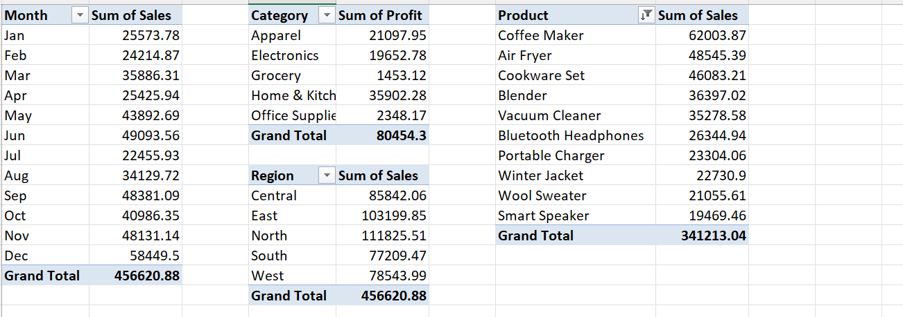

# retail-sales-kpi-dashboard
Interactive Excel KPI dashboard for retail sales — pivot tables, KPI cards, connected slicers.
## Behind the Scenes: Pivot Tables

The dashboard is powered by 4 pivot tables — Monthly Sales, Regional Sales, Category Profit, and Top 10 Products — each connected to the same set of slicers for synchronized filtering.
